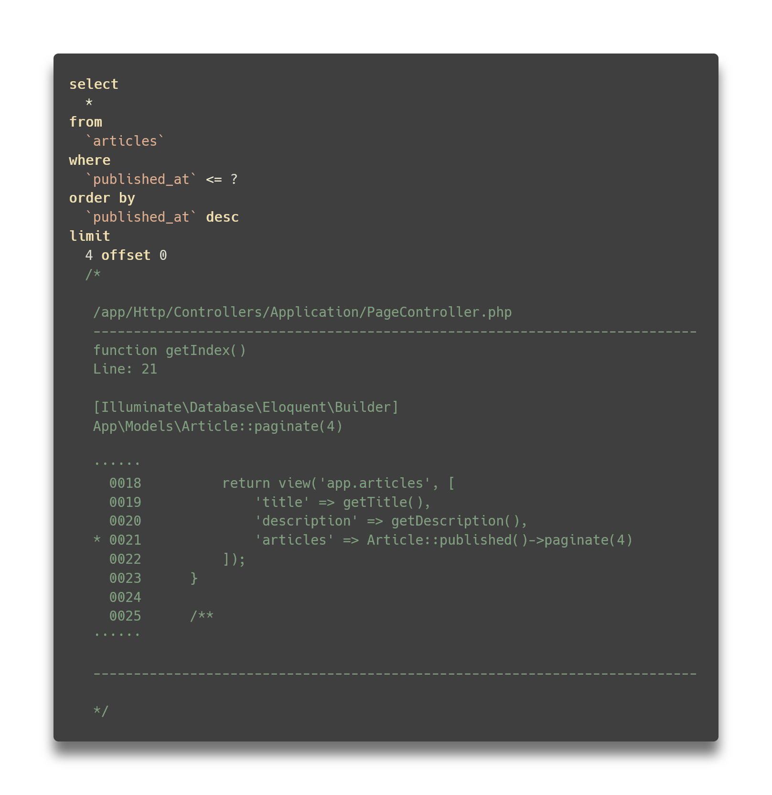

<div style="text-align: center;">
    <h1 style="border-bottom: 1px solid gray; padding-bottom: 5px; display: inline-block;">Laravel Query Tracer</h1>

[](https://packagist.org/packages/cybex/laravel-query-tracer)
[](https://packagist.org/packages/cybex/laravel-query-tracer)

[](https://github.com/cybex-gmbh/laravel-query-tracer/pull/)
[](https://github.com/cybex-gmbh/laravel-query-tracer/issues/)
[](https://laravel.com/docs/6.x)



</div>

## Stack Traces for Your Queries.

If you ever wondered where specific queries in your log originate from, or wanted to easily track down the code that
caused a slow query, this package is for you.

_Laravel Query Tracer_ hooks into your Eloquent and adds information from the most useful stack frame it finds, and adds
not only the class, file, line number, function name and called function, but also the relevant part of the source file.

## Installation

You can install the package via composer:

```bash
composer require cybex/laravel-query-tracer
```

## Usage

To activate the Query Tracer, just add the following line to your `.env` file:

```
QUERY_TRACER_ENABLED=true
```

Once you have done this, all Model queries will contain a comment with useful information to locate the source of the
query.

The easiest way to evaluate the queries is to install [Laravel Telescope](https://laravel.com/docs/8.x/telescope),
the [Laravel Debugbar](https://github.com/barryvdh/laravel-debugbar) or any other package that will log and display
queries.

## Configuration

The `query-tracer.php` config file can be published using the following command:

```bash
php artisan vendor:publish --provider="Cybex\QueryTracer\QueryTracerServiceProvider" --tag="config"
```

You can customize a variety of options which are explained in the comments inside the configuration file.

Additionally, some options can also be set using environment settings that you can put in your .env file as needed.

The available options with their corresponding env settings and defaults are:

| Option                         | Env                          | Default         | Description                                                                                                                                                                                                                                                                                                                                                                                                                                                                                                                              |
| :---                           | :---                         | :---            | :---                                                                                                                                                                                                                                                                                                                                                                                                                                                                                                                                     |
| enabled                        | QUERY_TRACER_ENABLED         | false           | Main switch for turning query tracer integration on/off. |
| mode                | QUERY_TRACER_MODE               | default   | Default mode of operation. When set to `scoped`, it will run in [scoped mode](#scoped-mode), otherwise it runs in [default mode](#default-mode).  |
| modelNamespace               | QUERY_TRACER_MODEL_NAMESPACE                             | '' | The path to your Models directory, relative to `/app`.                                                                                                                                                                                                                                                                                                                                                                                                                                                                                     |
| restrictToDriver                       | QUERY_TRACER_DRIVER            | '*'        | Specify which driver Query Tracer will attach to (e.g. mysql, pgsql, sqlite). If set to '*', it will attach to the first established connection.     |
| trace.logArray.enabled           | QUERY_TRACER_ENABLE_ARRAY_TRACE   | true          | If true, a trace key will be added to Laravel's QueryLog with all the information requested in `logArray.values`.                                                                                                                                                                                                                                                  |
| trace.logArray.key                         | QUERY_TRACER_LOG_KEY  | 'trace'               | Name of the key that will be used for adding the trace to the QueryLog.     |
| trace.sqlComment.enabled     | QUERY_TRACER_ENABLE_COMMENT_TRACE  | true                | If true, the query trace will be added to the query as an SQL comment. In `default` mode, the comment is added AFTER execution for logging only. In `scoped` mode, it will be added to the query BEFORE execution.  |
| trace.sqlComment.tag         | QUERY_TRACER_TAG           | ''   | If set, the SQL comments will carry this tag right after the opening comment token (`/*`).  |

## Modes of Operation

Query Tracer comes with two different modes of operation that are different in how they hook into the framework. If you
are debugging your queries locally within [Laravel Telescope](https://laravel.com/docs/8.x/telescope) or
the [Laravel Debugbar](https://github.com/barryvdh/laravel-debugbar), you will want to use `default` mode. If you want
the traces to appear in your database server, for example inside a slow query log or any other server log, you will have
to use `scoped` mode.

### Default Mode

In `default` mode, _Query Tracer_ overrides the logging method of Laravel's Database Connection class. In this mode, the
SQL comments are added to the queries after they have been executed on your DB server, and thus will not appear on the
server itself. Also, you can enable adding trace information to every QueryLog entry via `trace.logArray`:

```
       "query" => "select * from `pages` where `pages`.`parent_id` in (1, 2, 3, 4, 5, 6)",
       "bindings" => [],
       "time" => 0.41,
       "trace" => [
         "call" => "App\Models\Page::get()",
         "class" => "Illuminate\Database\Eloquent\Builder",
         "file" => "/app/Base/Helpers/ApplicationHelper.php",
         "function" => "{closure}()",
         "line" => 132,
         "source" => """
             0129      function getMenu()\n
             0130      {\n
             0131          return cache()->remember('menu', 60, function () {\n
           * 0132              return \App\Models\Page::where('parent_id', null)->with('children')->get();\n
             0133          });\n
             0134      }\n
             0135  }
           """,
       ],
```

By default, the key is called `trace`, but can be renamed using the `trace.logArray.key` option.

### Scoped Mode

In `scoped` mode, _Query Tracer_ attaches a global scope to each of your Models that will add a `where 1` to each query
that attaches the SQL comment with the trace. Therefore, each query is modified before its being executed and will
therefore be present in all logs along the way. Note that adding traces to the QueryLog will not work in `scoped` mode,
because the log method will not the overridden.

## Available Trace Values

The `query-tracer.trace.logArray.values` and `query-tracer.trace.sqlComment.template` options configure the values that
will be included in the QueryLog array and the SQL comments, respectively. The available values are the same for both
options; the only difference is that you need to precede them with `@` for use in the SQL template.

The following values are available for use:

### call

The call that triggered the query, including a synopsis of its arguments.

### class

The class of the object the call was executed on.

### compiled

Only set if the call is inside of a compiled Blade view. It then contains the file path of the compiled view,
while `file` contains the name of the original Blade template.

### file

The file that contains the call, including the path relative to the project root.

### line

The number of the line that contains the call.

### source

The part of the source code that contains the call. The amount of code listed is configurable with
the `query-tracer.trace.includeSourceLines` setting.

## Custom Formatters

You can replace for formatters for source code, call arguments, QueryLog arrays and SQL comments with your own
implementations by replacing the classes defined in the configuration.

### Argument Formatter

The argument formatter converts the call arguments from the stack frame into a printable representation. The formatter
class used is configured in `query-tracer.backtrace.argumentFormatter`. Argument formatters need to
implement `Cybex\QueryTracer\Interfaces\ArgumentFormatterInterface`.

A very easy implementation of a custom argument formatter that only prints arguments' types could look like this:

```php
<?php

namespace App\Classes;

use Cybex\QueryTracer\Interfaces\ArgumentFormatterInterface;

class CustomArgumentFormatter implements ArgumentFormatterInterface
{

    /**
     * Formats a single argument according to its type.
     *
     * @param $argument
     * @return string
     */
    public function formatArgument($argument): string
    {
        return gettype($argument);
    }


    /**
     * Formats the individual arguments for display in the call string.
     *
     * @param array $arguments
     * @return string
     */
    public function formatStackFrameArguments(array $arguments): string
    {
        return implode(
            ', ',
            array_map(
                function ($argument) {
                    return $this->formatArgument($argument);
                },
                $arguments
            )
        );
    }
}
```

To activate your implementation, you would then set `'argumentFormatter' => App\Classes\CustomArgumentFormatter::class`
in the configuration.

### Source Code Formatter

The source code formatter is responsible for retrieving the source code of a given file and return it in a printable
form. The formatter class is configured in `query-tracer.backtrace.sourceCodeFormatter`. Your own implementation has to
extend `Cybex\QueryTracer\Classes\AbstractSourceCodeFormatter`.

### LogArray Formatter

The LogArray formatter turns the raw trace array into an array ready to append to the DB QueryLog. The class can be
configured in `query-tracer.trace.logArray.formatter`. Your own implementation needs to
extend `Cybex\QueryTracer\Classes\AbstractTraceFormatter` which in essence only provides a `format()` method that must
return an `array` or `null`.

### SQL Comment Formatter

The SQL comment formatter formats the data from the raw trace array and populates the template configured
in `query-tracer.trace.sqlComment.template`. The formatter class is defined in `query-tracer.trace.sqlComment.formatter`
. Like the LogArray formatter, your implementation needs to extend `Cybex\QueryTracer\Classes\AbstractTraceFormatter`
which in essence only provides a `format()` method that must return a `string` or `null`.

## Testing

```bash
composer test
```

## Requirements

- PHP: 7.3, 7.4, 8.0, 8.1
- Laravel: 7, 8, 9

## Changelog

Please see [CHANGELOG](CHANGELOG.md) for more information on what has changed recently.

## Known Issues

* If there are any question marks in your trace, e.g. in the code listing, QueryExceptions will replace them with the
  parameter bindings, thus breaking the exception message (see
  related [issue](https://github.com/laravel/framework/issues/39239)). This is only a display issue in Laravel and will
  not affect query execution on the database server. To mitigate this, question marks are replaced with a UTF-8
  fullwidth question mark.
* If the origin of a query is a template, line numbers always refer to the compiled view. Since compiled views are not
  helpful in debugging, the original view file is automatically resolved and referenced. Thus, the source code location
  shown will only be accurate for very simple templates. The use of includes, blade components and directives may move
  the originating call in a different location. Therefore, always take the line numbers and source code of view
  locations with a grain of salt.

## Contributing

Please see [CONTRIBUTING](.github/CONTRIBUTING.md) for details.

## Security Vulnerabilities

Please review [our security policy](../../security/policy) on how to report security vulnerabilities.

## Credits

- [Web development team at Cybex GmbH - cybex-online.com](https://github.com/cybex-gmbh)
- [Oliver Matla](https://github.com/lupinitylabs)
- [All Contributors](../../contributors)

## License

The MIT License (MIT). Please see [License File](LICENSE.md) for more information.
